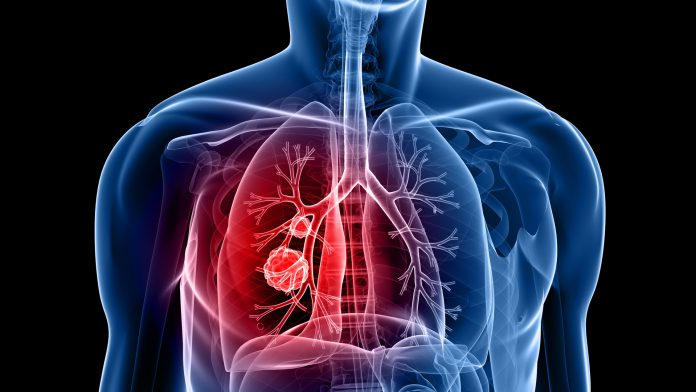

# lung cancer detection

In this project, I'm building an end-to-end deep learning model that loads CT data files to produce a Ct instance that contains the full 3D scan, combines that with a module that performs segmentation (flagging voxels of interest), and then group the interesting voxels into small lumps in the search for candidate nodules. The nodule locations are combined back with the CT voxel data to produce nodule candidates, which can then be examined by our nodule classification model to determine whether they are actually nodules in the first place and, eventually, whether they’re malignant.

## Setup

In order to train the models I developed in this project you will need access to at least:
- GPU (1050 GTX)
- 8 GB ram
- 240 GB free space
- download the Luna dataset which is divided to 10 different subsets of CT scans and some csv files that are already included in the github repo from : https://luna16.grand-challenge.org/download

## Project steps

1. Load our raw CT scan data into a form that we can use with PyTorch. Putting
raw data into a form usable by PyTorch will be the first step in any project you
face. The process is somewhat less complicated with 2D image data and simpler
still with non-image data.

2. Identify the voxels of potential tumors in the lungs using PyTorch to implement
a technique known as segmentation. This is roughly akin to producing a heatmap
of areas that should be fed into our classifier in step 3. This will allow us to focus
on potential tumors inside the lungs and ignore huge swaths of uninteresting
anatomy (a person can’t have lung cancer in the stomach, for example).
Generally, being able to focus on a single, small task is best while learning.
With experience, there are some situations where more complicated model
structures can yield superlative results (for example, the GAN game we saw in
chapter 2), but designing those from scratch requires extensive mastery of the
basic building blocks first. Gotta walk before you run, and all that.

3. Group interesting voxels into lumps: that is, candidate nodules (see figure 9.5
for more information on nodules). Here, we will find the rough center of each
hotspot on our heatmap.
Each nodule can be located by the index, row, and column of its center point.
We do this to present a simple, constrained problem to the final classifier.
Grouping voxels will not involve PyTorch directly, which is why we’ve pulled this
out into a separate step. Often, when working with multistep solutions, there will
be non-deep-learning glue steps between the larger, deep-learning-powered
portions of the project.

4. Classify candidate nodules as actual nodules or non-nodules using 3D convolution.
This will be similar in concept to the 2D convolution we covered in chapter 8.
The features that determine the nature of a tumor from a candidate structure are
local to the tumor in question, so this approach should provide a good balance
between limiting input data size and excluding relevant information. Making
scope-limiting decisions like this can keep each individual task constrained,
which can help limit the amount of things to examine when troubleshooting.

5. Diagnose the patient using the combined per-nodule classifications.
Similar to the nodule classifier in the previous step, we will attempt to deter-
mine whether the nodule is benign or malignant based on imaging data alone. We
will take a simple maximum of the per-tumor malignancy predictions, as only one
tumor needs to be malignant for a patient to have cancer. Other projects might
want to use different ways of aggregating the per-instance predictions into a file
score. Here, we are asking, “Is there anything suspicious?” so maximum is a good
fit for aggregation. If we were looking for quantitative information like “the ratio
of type A tissue to type B tissue,” we might take an appropriate mean instead.
